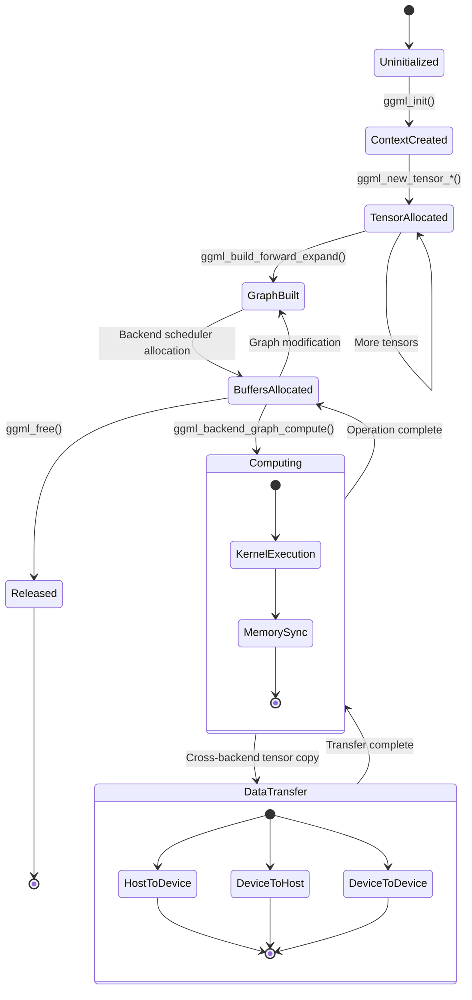

# GGML Architecture Documentation

## Overview

GGML is a minimalistic tensor library for machine learning designed for efficient computation across various hardware backends. The library provides a computation graph abstraction that enables automatic differentiation and optimization while supporting multiple backend implementations for diverse hardware platforms.

## High-Level System Architecture

## Backend Architecture

## Computation Graph Flow

## Memory Management State Diagram

## Core Components

### 1. Tensor System

The tensor system is the foundation of GGML, providing:

- **Multi-dimensional tensors**: Support for up to 4 dimensions
- **Data types**: FP16, FP32, quantized types (Q4_0, Q4_1, Q8_0, etc.)
- **Operations**: 100+ tensor operations including arithmetic, neural network layers, and custom operations
- **Memory layout**: Efficient stride-based memory layout with padding support

### 2. Computation Graph

The computation graph enables:

- **Automatic differentiation**: Forward and backward pass computation
- **Lazy evaluation**: Operations are recorded but not executed until explicitly computed
- **Optimization**: Graph-level optimizations and fusion opportunities
- **Parallelization**: Independent operations can be executed in parallel

### 3. Backend System

The backend system provides:

- **Hardware abstraction**: Unified interface across different hardware platforms
- **Dynamic dispatch**: Runtime selection of optimal backend for each operation
- **Memory management**: Backend-specific memory allocation and transfer
- **Synchronization**: Event-based synchronization for asynchronous operations

### 4. Memory Management

Memory management features:

- **Pool allocation**: Pre-allocated memory pools for zero-allocation runtime
- **Backend buffers**: Hardware-specific memory buffers (GPU memory, pinned memory)
- **Automatic layout**: Automatic tensor layout conversion between backends
- **Quantization**: In-place quantization for memory efficiency

## Key Data Structures

### Tensor Structure

### Backend Interface

## Operation Pipeline

The operation execution follows this pipeline:

1. **Tensor Creation**: Tensors are created in the context memory pool
2. **Graph Building**: Operations create computation graph nodes
3. **Backend Selection**: Scheduler selects optimal backend based on:
   - Operation support matrix
   - Tensor location (avoid unnecessary transfers)
   - Device capabilities and load
4. **Memory Allocation**: Backend-specific buffers are allocated
5. **Kernel Execution**: Backend executes the operation kernel
6. **Synchronization**: Results are synchronized across backends if needed

## Quantization System

GGML supports various quantization schemes for memory efficiency:

- **Q4_0, Q4_1**: 4-bit quantization with different scaling approaches
- **Q8_0**: 8-bit quantization for reduced precision
- **K-quantizations**: Advanced quantization schemes (Q2_K, Q3_K, etc.)
- **IQ-quantizations**: Integer quantizations for specialized hardware

## File Format (GGUF)

The GGUF format provides:

- **Metadata**: Model architecture, hyperparameters, tokenizer info
- **Tensors**: Quantized model weights and biases
- **Extensibility**: Key-value metadata system for future extensions
- **Backwards compatibility**: Version-aware reading with graceful degradation

## Performance Optimizations

### Adaptive Attention Allocation

The system implements adaptive attention allocation through:

- **Dynamic backend selection**: Runtime profiling of operation performance
- **Memory bandwidth optimization**: Minimizing data movement between devices
- **Kernel fusion**: Combining operations to reduce memory bandwidth
- **Asynchronous execution**: Overlapping computation and memory transfers

### Cognitive Synergy Optimizations

The architecture enables cognitive synergy through:

- **Multi-backend parallelism**: Distributing work across multiple devices
- **Pipeline parallelism**: Overlapping different stages of computation
- **Memory hierarchy optimization**: Leveraging different memory types efficiently
- **Quantization awareness**: Dynamic precision selection based on accuracy requirements

## Integration Points

### Neural-Symbolic Integration

GGML provides integration points for neural-symbolic computation:

- **Custom operations**: Support for domain-specific operations
- **Graph modification**: Runtime graph manipulation for symbolic reasoning
- **Hybrid execution**: Mixing symbolic and neural computation paths
- **External libraries**: Integration with BLAS, cuBLAS, and specialized libraries

### Emergent Patterns

The architecture supports emergent computational patterns through:

- **Dynamic graph modification**: Runtime adaptation of computation patterns
- **Attention mechanisms**: Built-in support for attention-based architectures
- **Recurrent patterns**: Support for RNN, LSTM, and other recurrent architectures
- **Transformer patterns**: Optimized implementations of transformer building blocks

## Future Extensions

The architecture is designed for extensibility:

- **New backends**: Plugin architecture for additional hardware support
- **Advanced quantization**: Research-driven quantization schemes
- **Distributed computation**: Multi-node execution support
- **Adaptive optimization**: ML-driven optimization parameter selection

This documentation provides a comprehensive view of the GGML architecture, capturing both the technical implementation and the emergent cognitive patterns that arise from the system's design.